# Magasinet Ekorren


This website was created for a company called Magasinet Ekorren ('The Squirrel Warehouse' roughly translated from Swedish to English). 
The company provides storage units in various sizes for rent to persons and businesses. The website provides short and concise information about the storage units and how to rent them. It provides a service for creating an account, and managing the orders and customer information on a user panel page. 
There is also an admin panel where the site owner can manage the database and collect an updated customer registry.

The project is a part of the [Code Institute Full Stack Developer Program](https://codeinstitute.net/se/full-stack-software-development-diploma/) and is my fourth "portfolio project".

The website can be [found here](https://magasinet-ekorren.herokuapp.com/).

## Table of Contents

- [UX and UI](#ux-and-ui)
  - [Site Owner Goals](#site-owner-goals)
  - [User Stories](#user-stories)
  - [Wireframes](#wireframes)
- [Design](#design)
  - [Imagery](#imagery)
    -[Logo](#logo)
    -[Hero image](#hero-image)
    -[Why us section](#why-us-section)
  - [Colours](#colours)
  - [Fonts](#fonts)
  - [Favicon](#favicon)
- [Features](#features)
  - [Header](#header)
  - [Carousel](#carousel)
  - [All Sections](#all-sections)
  - [About Section](#about-section)
  - [Media Section](#media-section)
  - [Events Section](#events-section)
  - [Contact Section](#contact-section)
  - [Footer](#footer)
- [Deployment](#deployment)
- [Testing](#testing)
  - [Validator Testing](#validator-testing)
  - [Manual Testing](#validator-testing)
  - [Bugs](#bugs)
- [Credits](#credits)
  - [Languages](#languages)
  - [Frameworks, Libraries and Tools](#frameworks-libraries-and-tools)
  - [Images](#images)
  - [Content](#content)

#

## UX and UI

### Site Owner Goals

  The website was developed together with the site owner to ensure the main goals of the site was met:

  - Provide information as a marketing tool to get new customers
  - Let the customer rent a storage unit online
  - Present information in a professional and accessible way
  - Ease process of updating the customer database for the product owners invoice program
  - Deploy automated emails for confirmation and notification to the customer and the product owner

#

### User Stories

Agile development practices such as user stories were managed by using GitHub's "Issues" tab in the GitHub repository.

The GitHub project can be found [here](https://github.com/users/Johneriksson88/projects/4/views/1).
The Issues page can be found [here](https://github.com/Johneriksson88/ekorren/issues).

User stories were divided into three categories:

  - Visitor - a prospective customer enquiring information to make a decision to rent a storage unit
  - Customer - a customer which has decided to rent a storage unit from Magasinet Ekorren
  - Admin - the site owner/administrator

### Visitor Goals

  [1](https://github.com/Johneriksson88/ekorren/issues/3). As a visitor I can access information about contact, directions and practical information so that I can learn more about the company, their products and how to get in touch with them.

  [2](https://github.com/Johneriksson88/ekorren/issues/2). As a visitor I can see arguments for why I would want to rent a storage unit from Magasinet Ekorren so that I can make a decision to rent or not to rent a storage unit.

  [3](https://github.com/Johneriksson88/ekorren/issues/1). As a visitor I can access information about the different products and their prices so that I can make a decision to rent or not rent a storage unit.

### Customer Goals

  [1](https://github.com/Johneriksson88/ekorren/issues/14). As a customer/visitor I can get clear messages on top of the page so that I get feedback on what I've done.

  [2](https://github.com/Johneriksson88/ekorren/issues/11). As a customer I can view my orders so that I know what and how many storage units I'm renting.

  [3](https://github.com/Johneriksson88/ekorren/issues/10). As a customer I can edit my contact information so that my contact and invoice details are up to date.

  [4](https://github.com/Johneriksson88/ekorren/issues/9). As a customer I can delete orders so that I can cancel my rental of storage unit/units.

  [5](https://github.com/Johneriksson88/ekorren/issues/8). As a customer I can delete my account so that I can choose not to be a customer any more.

  [6](https://github.com/Johneriksson88/ekorren/issues/5). As a customer I can register an account so that I can update my information and manage/make new orders.

  [7](https://github.com/Johneriksson88/ekorren/issues/4). As a customer I can rent a storage unit directly from the web site so that I can quickly act on my decision to rent a storage unit from Magasinet Ekorren.

### Admin goals

  [1](https://github.com/Johneriksson88/ekorren/issues/7). As an admin I can login to an admin account so that I can access the admin panel.

  [2](https://github.com/Johneriksson88/ekorren/issues/12). As an admin I can get an email notification when a new order is submitted so that I can manually process it.
  
  [3](https://github.com/Johneriksson88/ekorren/issues/13). As an admin I can get an email notification when an order is deleted so that I can cancel the invoicing for that order.

  [4](https://github.com/Johneriksson88/ekorren/issues/6). As an admin I can download the customer registry so that I can view it and import it to my invoice software.

#

## Wireframes

The wireframe for this website were created using Balasmiq. The end product ended up a little bit different from the original wireframe, due to considerations and ideas changing as the creative process flowed on. I only made a wireframe for the landing page, as to get a big picture feel of how the website should look and feel. The user panel and subsequent pages was design on the fly experimenting with different bootstrap components.

The initial idea was to have a true one page website with the order form on the bottom of the page, but after experimenting it felt more logical to have this step separated from the landing page which i wanted to be purely informational, and leading a potential customer to ordering with calls to action.

Also, as I realized that I needed to have a login function where the user could perform full CRUD functionality on the database - as per the assessment criteria of the project - it made even more sense to have the order form on another page.

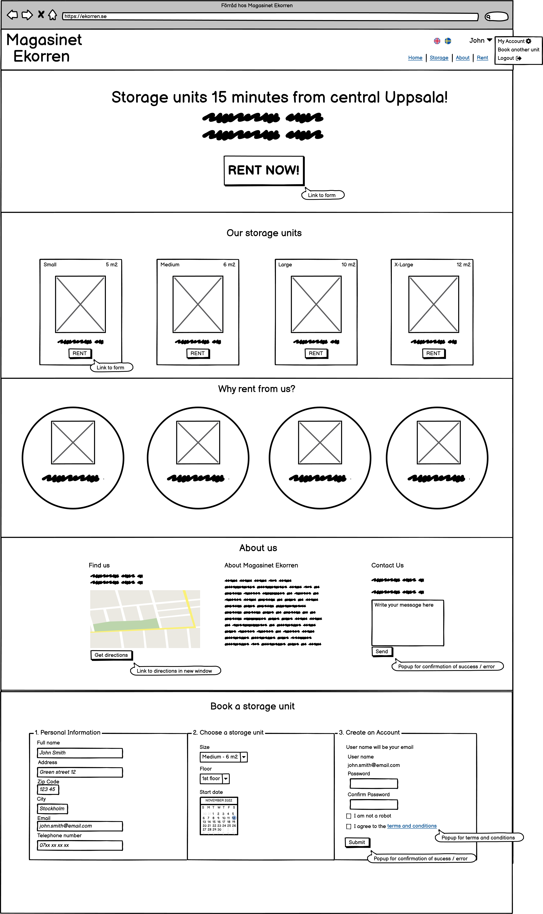


## Design

#

## Imagery

### Logo
  The company logo in the left part of the header has an acorn icon from [flaticon.com](https://www.flaticon.com/). Since the squirrel ('ekorre' in Swedish) is part of the company name, and it repesents the nature of storing and collecting things in one place (think of a squirrel gathering acorns), the acorn felt appropriate for part of the logo. It was the lowest common denominator between the business (storage) and the name (ekorre) and felt natural.

### Hero image
  The hero image of cardboard boxes were purchased from [shutterstock](https://www.shutterstock.com/). They are supposed to represent the nature of storing things in boxes, and provide a fairly uniform color without taking up too much visual capital. This image was the closest option to having a monocolor or gradient background, but with the benefit of having appropriate objects for the business.

### Product cards
  The images for the product cards on the landing page was purchased from [shutterstock](https://www.shutterstock.com/). They are possibly temporary as the site owner wanted to create more personal image representations of the different sizes storage units themselves, but has not done so yet.

### Why us section
  The "why us" section contains 4 icons from [flaticon.com](https://www.flaticon.com/). They were chosen to visually represent the 4 given benefits of renting a storage unit from Magasinet Ekorren. If a visitor were to quickly scroll through the page, the icons being circled to give a badge-like appearance catches the visitor eye and tells a clear story of why Magasinet Ekorren would benefit them.

#

## Colours

From the start the colors were picked from a squirrel themed palette i found [here](https://colorpalettes.net/tag/colour-of-squirrel-coat/) to represent the colors of the squirrel. At the end of the project when doing the lighthouse testing, I realized that the contrasts using these colors did not pass through the availabilaty-test. After playing around with the Chrome developer tools for testing contrast and availability, i found completely different colors that felt modern, fresh and most of all accessable to the visually impaired and color blind. So essentially accessability dictated the color choices of the entire website.

Inspiration for color choices can come from a million different places, and I think this shows that a simple thing as playing around with an accessability tool can work at least as well as looking at a color palette.

To separate the sections on the landing page i chose to have every other section (Get started and Why rent from us) have a contrasting background color of #74cfbf to the other white ones. I did this to clearly signal that the visitor is looking at another section.

#

## Fonts

The fonts Cinzel Decorative, Bevan and Lato were chosen from the options available from Google Fonts.

  - [Cinzel Decorative](https://fonts.google.com/specimen/Cinzel+Decorative?query=cinzel) is only used for the company logo in the header. I thought it looked elegant, modern and the wavy swirls of the capital "M" in "Magasinet" looked almost like a squirrels tail.

  - [Bevan](https://fonts.google.com/specimen/Bevan?query=bevan) was chosen for the headings. It is a bold display font that i think clearly defines a new section of the page with its boldness and thickness.

  - [Lato](https://fonts.google.com/specimen/Lato?query=lato) was the given choice for all the body text. It is a very popular and familiar font for people browsing the web. The description says: "The semi-rounded details of the letters give Lato a feeling of warmth, while the strong structure provides stability and seriousness", and i felt that these keywords jived with the website as a whole.

#

## Favicon

The favicon is the same icon as in the logo, and was the clear candidate for representing Magasinet Ekorren as explained in the [logo](#logo) paragraph.


#

## Database Models

The database schema were planned out on pen and paper. It was implemented in the models.py file as three different models:

### Customer model

The customer model holds the registered customer, with a one-to-one field connected with the User model. It holds the information relevant for the site owner to invoice and contact the customer.
All models have a primary key automatically generated by Django (BigAutoField), which is why it is not listed below. This took me a while to find out because it is happening behind the scenes.

| Name | Field type |
| ----------- | ----------- |
| user | OneToOneField(User) |
| fullname | CharField |
| address | CharField |
| zipcode | CharField |
| city | CharField |
| email | EmailField |
| phone | CharField |
| person_or_org_nr | Charfield |

### User model

The user model is not defined in models.py, as it uses the ready made Django class.
The form only uses the username, password1 and password2 fields.
The user object came in handy when trying to access the logged in used and its subsequent customer object in the code by using `request.user`.

### Storage Unit model

The storage unit model holds the seven different types of storage units that a customer can rent. These are used in a dropdown list in the order form for the customer to pick from.

| Name | Field type |
| ----------- | ----------- |
| name | CharField |
| size | CharField |
| floor | CharField |
| price | IntegerField |

### Order model

The order model stores the orders for the site owner to manually process. The storage_unit foreign key connects the order to which storage unit was ordered, and the customer foreign key to the customer who made the order.

| Name | Field type |
| ----------- | ----------- |
| order_date | DateField |
| start_date | DateField |
| storage_unit | ForeignKey(StorageUnit) |
| customer | ForeignKey(Customer) |


## Features

### Header


- The header consists of a [bootstrap component](https://getbootstrap.com/docs/4.0/components/navbar/) which is slightly modified to fit the logo, navbar and login/logout and account related links.
- The navbar has a fixed position at the head of the page which sits above all other content. This was chosen over a sticky position mainly for browers compatibility, but it's function does not vary in any significant way to a fixed position.
- The header is fully responsive and collapses the three navbar links and instead shows a clickable "hamburger menu" for viewport widths of 991px and smaller.

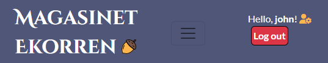

### Logo
The logo is described [here](#logo).

### Navigation links
There are 3 main navigation links:
  - **Home** - leads to the top of the landing page.
  - **Storage Units** - leads to the product cards section on the landing page.
  - **About & Contact** - leads to the About & Contact section on the landing page.
    
  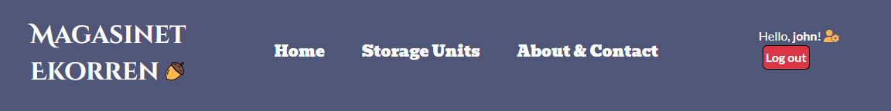

In the right side of the header are the dynamic log in/log out and account related links:
  - **Log in** - This button is showed only if a user is _not_ logged in, and leads to the login page.
  - **Log out** - This button is showed only if a user _is_ logged in and logs out the user and redirects to the landing page.
  - **Hello, _username_** - This is a dynamic message which greets the user and tells them they are logged in. It is only showed if a user is logged in.
  -  **User panel icon** - This is the link to get to the user panel. It is only showed if a user is logged in.
  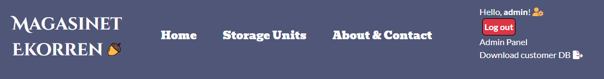
  - **Admin panel** - This is a link to the Django admin panel, where the admin can manage the database. This is only showed if a superuser is logged in.
  - **Download Customer DB** - This is a direct download link that downloads the current customer database in a CSV-file format. This is only showed if a superuser is logged in.

#

## Messages

Directly below the header is a hidden div for messages. Here the user gets feedback when for example an account has been created, an order has been made or deleted. The message div is a part of the base template, hence it will show on whatever page the user is. The message dissappears after 5 seconds, coded with some custom JavaScript.
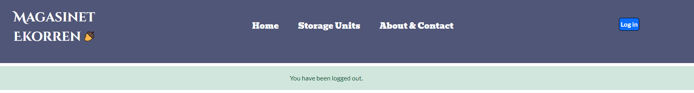


## Lead

Below the header and eventual messages is a lead paragraph. This space is reserved to display offers to the visitor with the intent to catch their interest in making a decision to rent a storage unit. The lead has a contrasting background color of #f7ba5b to pop out between the header and hero section.

#

## Hero Section

The hero section is designed to quickly communicate what Magasinet Ekorren is about. The "Rent now"-button is a call to action so the visitor quickly can get to business renting a storage unit. At the bottom is a lead paragraph with the starting price highlighted by green, which communicates the competative prices that Magasinet Ekorren actually has.
The hero image is described [here](#hero-image).

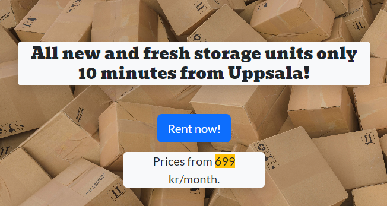

#

## Instructions section 

The Instructions section is intended to show the visitor how easy it would be for them to go ahead and rent a storage unit from Magasinet Ekorren. Originally there were six steps, but after some feedback from friends i narrowed it down to three to emphasize how simple it is. As with most of the landing page, this section further informs the visitor and helps them towards a decision.

This section has a contrasting background color to the two adjacent sections to help separate them. On bigger screens the list is displayed inline, and on smaller screens the list items are stacked vertically.

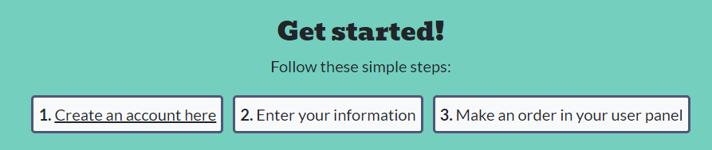

#

## Product cards section

The product cards section is designed to clearly inform the visitor of the four different products that are available to them.
  
  - Every card has a header, a corresponding image to the size of the storage unit, information about size and price, and lastly a button which calls to action with the text "Rent now".
  - The "Rent now"-button leads to the order form if a user is logged in, or the login page if no user is logged in.
  - The images are explained [here](#product-cards)
  - The cards fluently follows the screen widths, moving cards down a row, from four on one row on bigger screens, down to one on each row on the smallest screens.

  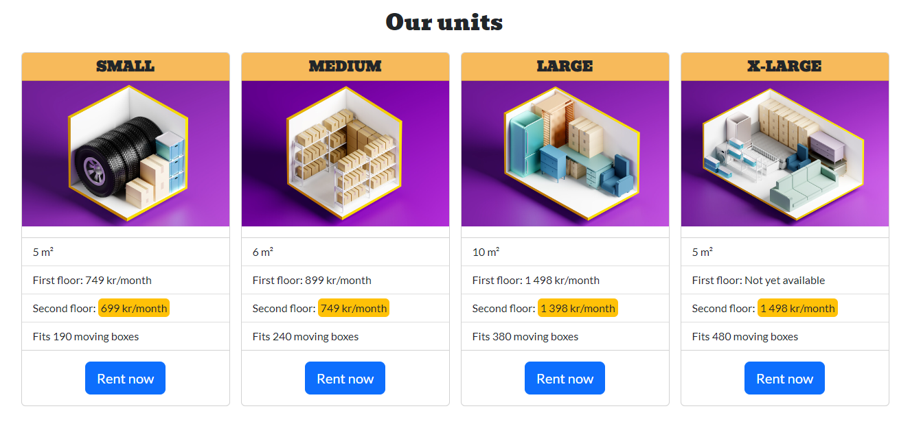

  #

## Why us section

The Why us section is there to give the visitor four reasons why they would want to rent a storage unit from Magasinet Ekorren.
  - It is designed to quickly catch the eye of the visitor, without having too much text that could cause them to scroll by it.
  - Like the instructions section, it has a contrasting background color to separate it from its adjacent sections.
  - The images is explained [here](#why-us-section)
  - The "badges" follows screen widths from all on one row on bigger screens, two on two rows on medium screens, and lastly one on each row on smaller screens.

  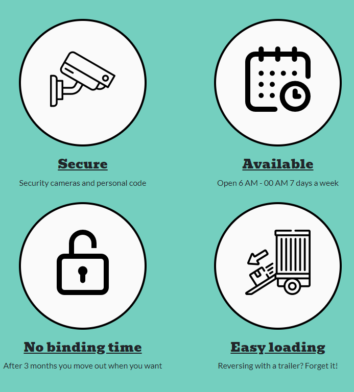

  #

## About & Contact section

  The decision to include the Find us, About and Contact sections into one was for the navbar to have a minimum number of links. Having only three links decreases cluttering and looks less confusing to the visitor. This was also a suggestion from my mentor. Since the three sections are highly related i saw no problem in collecting them into one section.
  The three sections are vertically stacked on all viewport widths and divided into cards. They all share styles with a rounded edge and a shadow, to have them appear to float on the page. This way they stick out from the white background and look easier on the eye.

### Find us
  - The Find us header has a map icon from [fontawesome](https://fontawesome.com/) which visually reinforces what the section presents.
  - The map is an embedded google map, with a link to quickly get directions to the storage unit facility.
  - The iframe element has the attribute of 'loading="lazy"' to force it to load once the visitor scrolls down to it, as opposed to when the whole page loads.

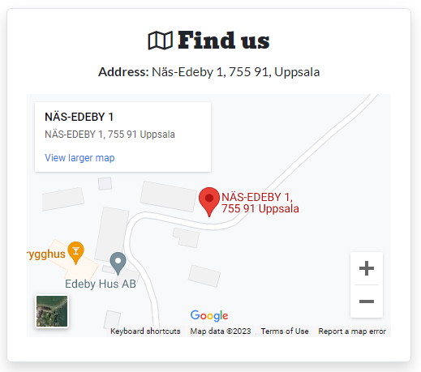

### About us
  - The About us section header has an information "i" icon to represent that the visitor can find information about the company here.
  - The text is a short presentation of the company, their values and a short paragraph about the storage units.
    
  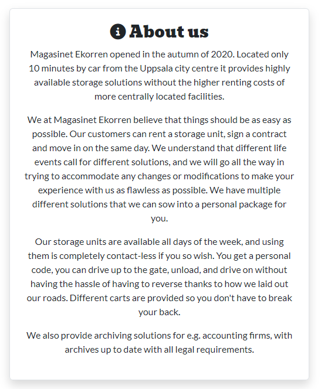

### Contact Us
  - The contact us section contains of a phone number, email adress and a contact form.
  - The phone number is a direct call link (in html *a href="**tel**:0706499977"*) and the email is a direct mail link.
  - The concat form consists of a Name field, an Email field and a Message field. The field labels are missing, which from the beginning was a happy accident due to the loading of the form with template tags. I decided to keep it that way to minimize the amount of visual space taken up by the form. You could say the labels are in the placeholders of the fields.

  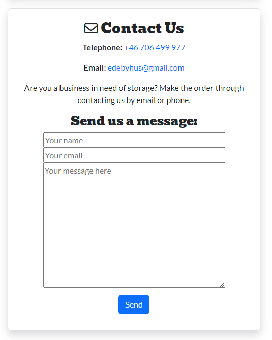

#

## Footer

The Footer is divided into three parts:
  - Copyright text on the left with a script updating the year to the current one.
  - An acorn in the middle to give it some color and wrap the end of the page nicely.
  - Navigation links to the right with an added link to register if the visitor is not logged in or to the user panel if the user is logged in.
  - The footer is fixed to the bottom of the viewheight window by means of the bootstrap "fixed-bottom" class.
  - It has the same background color of #505677 as the header to create continuity in the design.

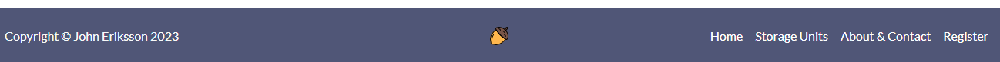

#

## User panel

The user panel is the main page for the customer to handle their orders and information. The page is only available to registered users using the Django decorator `@login_required` in front of the view function. Here the user can perform full CRUD(**C**reate, **Read**, **U**pdate, **D**elete) functionality.

### Header
The header has a heading saying "My account" to inform the user where they are. To the right is a red button for deleting the account.

### My Orders section 
- The order section is formatted with the [bootstrap cards](https://getbootstrap.com/docs/4.0/components/card/) component.
- The header has a color of #f7ba5b to clearly define the top of the card.
- Underneith is a table formatted with the [bootstrap table](https://getbootstrap.com/docs/4.1/content/tables/) component. The table displays all the orders of the user, with the rows order no., storage unit, start date and remove. Remove is represented by a red trash can icon and takes the user to a order deletion confirmation page where they have to confirm that they want to delete the order and are informed that it will terminate the rental of that storage unit.
- On the bottom of the card is a blue "New order" button which takes the user to the order form where they can make new orders.

### My information section
- The my information section is a separate card that displays the users contact information in a unordered list form.
- In the header is a "Edit" button which takes the user to another page where they can edit their contact information in a form.
- The form uses the same Django form as the customer form, so the validation is the same for the two.

#

## Log in page
  - The login page is a small "card" with a username and a password field.
  - The design for the login and register page was derived from Youtuber [Dennis Ivys](https://www.youtube.com/c/DennisIvy?app=desktop) tutorial on [Django user registration](https://www.youtube.com/watch?v=tUqUdu0Sjyc&t=694s&ab_channel=DennisIvy).
  - I liked the design so much i decided to use it, and he openly shares the code for it [here](https://jsfiddle.net/ivanov11/dghm5cu7/).
  - The log in button logs in the user through the [Django login class](https://docs.djangoproject.com/en/4.1/topics/auth/default/#how-to-log-a-user-in) and takes them to the user panel.
  - On the bottom is a "Sign up" link for new users to register.

## Registration page
  - The registration page is reached by clicking the "Sign up" link on the login page.
  - The form takes a username, a password and a repeat password.
  - The form validation is handled by [Django forms](https://docs.djangoproject.com/en/4.1/ref/forms/) and wont' accept an existing username, a password below 8 characters without a capital letter and number, the same repeat password or empty fields.
  - The design for the registration page follows the same [tutorial](https://www.youtube.com/watch?v=tUqUdu0Sjyc&t=694s&ab_channel=DennisIvy) as the login page. His original source code for the registration page can be found [here](https://jsfiddle.net/ivanov11/hzf0jxLg/)

#

## Send email

When a visitor uses the contact form, creates or makes/deletes an order an email is sent using the Django [send_mail](https://docs.djangoproject.com/en/4.1/topics/email/) class. These emails are intended to go to the site owner so they can process the order manually and contact the customer in case there is a problem or question about the order. The site owner wanted it this way for them to not lose a sale if a customer e.g. booked a storage unit type that was not available. Then they could contact the customer and work out a deal on a different storage unit type. This is also the reason there is no inventory on the storage units.
Magasinet Ekorren is a small scale business with a small base of customers, so making everything automated for its own sake made no sense.

At the moment all emails go to an SMTP test server on the free service [Mailtrap](https://mailtrap.io/). This is to make sure the email functionality works and that the emails are sent. To this day the site owner has not set up a paid SMTP service, which is required to securely and professionally send emails to real life email addresses. This is why the emails still go to this test server.

#

## Features Left to Implement

- Ability to rent a storage unit without having to create an account
- Online payment method
- Order history on user panel
- Identity validation through swedish BankID
- Uniform form validation on all pages (right now the different validation messages does not have the same appearance)

#

## Technology

This section covers all technology components and choices.

### Technology Choices

- [GitHub](https://github.com/)
	- version control and hosting during development.
- [GitPod](https://gitpod.io/)
  - in-browser editor.
- [HTML 5.2](https://www.w3.org/TR/html52/)
	- to create the content.
- [Bootstrap 5.2.2](https://getbootstrap.com/)
	- to style the content, provide the layout and some JavaScript functionality.
- [jQuery 3.6.0](https://jquery.com/)
  - to manipulate the DOM.
- [CSS 3](https://www.w3schools.com/css/default.asp)
  - additional styling and layout.
- [Django 4.1.3](https://docs.djangoproject.com/en/4.1/)
  - the main bulk of the project used Djangos Python-based built-in features.
- [Python](https://www.python.org/)
	- an interpreted, high-level, and general-purpose programming language.
- [Code Institute GitPod Full Template](https://github.com/Code-Institute-Org/gitpod-full-template)
	- the template i started my project with.
- [Cloudinary](https://cloudinary.com/)
  - a cloud storage service that i used for static files and images.
- [Jinja 3.1 ](https://jinja.palletsprojects.com/en/3.1.x/)
	- to be able to write Python code mixed with the HTML.
- [GitHub](https://github.com/)
	- project repository and version control.
- [Heroku](https://heroku.com/)
	- for deployment and hosting.
- [Balsamiq](https://balsamiq.com/wireframes/)
  - to create the wireframe.
- [Lucidchart](https://www.lucidchart.com/)
  - to create a flowchart.
- [Autopep8](https://pypi.org/project/autopep8/)
  - to correctly format all Python code to PEP8 standards.
- [ElephantSQL](https://www.elephantsql.com/)
  - database hosting.
- [Mailtrap](https://mailtrap.io/)
  - SMTP server for email testing.


#

## Deployment

### Deployment to heroku

**In your terminal** 

1. Add the list of requirements by running the command "pip3 freeze --local > requirements.txt"
2. Git add and git commit the changes made

**Log into heroku**

3. Log into [Heroku](https://dashboard.heroku.com/apps) or create a new account and log in
4. In the top right-hand corner click "New" and choose the option Create new app, if you are a new user, the "Create new app" button will appear in the middle of the screen
5. Write app name - it has to be unique
6. Choose Region
7. Click "Create App"

**The page of your project opens**

8. **IMPORTANT** - Make sure all secret keys and passwords are kept in an env.py file in your root directory. Put the reference to env.py in the gitignore file as to not accidentally share it with others.
  Access the variables by using e.g.: 
  ```
  os.environ.get('SECRET_KEY')
  ```

9. Click "Settings" from the menu on the top of the page

10. Go to section "Config Vars" and click button "Reveal Config Vars". 

11. Add the below variables to the list

    * DATABASE_URL as provided by ElephantSQL
    * SECRET_KEY is the django secret key and can be generated [here](https://miniwebtool.com/django-secret-key-generator/). 
    * Cloudinary URL can be obtained from [cloudinary](https://cloudinary.com/). Follow the steps on the website to register. 

**Go back to your code**

12. Procfile needs to be created in your app and contain:
```
web: gunicorn PROJECT_NAME.wsgi
```

13. In settings in your base app add the Heroku URL to ALLOWED_HOSTS

14. Add and commit the changes in your code and push to github

**Final step - deployment**

15. Next go to "Deploy" in the menu bar on the top 

16. Go to section "deployment method", choose "GitHub"

17. New section will appear "Connect to GitHub" - Search for the repository to connect to

18. Type the name of your repository and click "search"

19. Once Heroku finds your repository - click "connect"

20. Scroll down to the section "Automatic Deploys"

21. Click "Enable automatic deploys" or choose "Deploy branch" and manually deploy

22. Click "Deploy branch"

Once the program runs you should see the message "the app was sussesfully deployed".


### Deployment problems

Initially deploying served some problems. A big one was that my static files didn't load. This is because i didn't have initial serving of the static files.
After double checking my code against [this](https://dev.to/successhycenth/uploading-images-to-cloudinary-storage-from-a-django-drf-application-c40) guide I got it to work.

#

## Testing

### **HTML and CSS**

The HTML and CSS was tested using the tools made available by the [World Wide Web Consortium](https://www.w3.org/), also known as "W3C".

The two tools used were the [Markup Validation Service](https://validator.w3.org/#validate_by_uri) and the [CSS Validation Service](https://jigsaw.w3.org/css-validator/#validate_by_uri).

All HTML-files and the styles.css-file were tested without any errors.

### **HTML Validator Problems**

In using the "Validate by URI" function in the HTML validator, I found that the validator was throwing errors related to the jinja templating language mixed with the HTML (for example for and if statements as ""). The solution i found was to open the page in a browser, righ click anywhere on the page and press "Check page source", and copying the output HTML directly from there and put it in the "Validate by Direct Input"  function. This way i get the fully rendered HTML without the jinja template tags and the validation threw no errors.

### **JavaScript**

The script.js-file was tested in the [jshint](https://jshint.com/) tester without any errors or warnings.

### **Python**

All python-files were tested for syntax errors in the [Python syntax checker](https://extendsclass.com/python-tester.html).

I got only one error which was in views.py:
```
Syntax errors detected :

Line 196:
messages.success(request, f"Order #{order_id} successfully deleted.")
^
SyntaxError: invalid syntax
```

Asking friends and fellow students there was no apparent error with the code (note that the debugger does not throw this error) and as it works as intended i left the code as it was.

#

## **Manual Testing**

The site was tested manually across a range of devices to ensure all links and styling work correctly and to ensure responsiveness across a range of devices. All features on the page were tested, especially the form validation, to ensure user feedback worked properly and no faulty inputs could be made. 

Testing was carried out on multiple browsers such as Google Chrome, Microsoft Edge, Mozilla Firefox, Safari and Opera. Testing was carried out on an Apple iPhone 12, Apple iPhone 13, Huawei P20, iPad Mini and Windows 10 Desktops.

### **Manual tests**

The manual testing was divided up into the websites different functions:

  1. Log in/log out
  2. Create account
  3. Contact form
  4. User panel
  5. Order form
  6. Customer form
  7. Send email

#

1. **Log in/log out**

| Expected outcome | Test | Result |
| ----------- | ----------- | ----------- |
| Clicking the Log in button takes me to the login page | Click the login button | PASS |
| Logging in with an invalid username gives me a feedback message | Enter an invalid username | PASS |
| Logging in with an invalid password gives me a feedback message | Enter an invalid password | PASS |
| Clicking any "Rent now" button on the landing page takes me to the log in page if I'm not logged in | Click every "Rent now" button on the landing page while logged out | PASS |
| Clicking any "Rent now" button on the landing page takes me to the order form if I'm logged in | Click every "Rent now" button on the landing page while logged in | PASS |
| Logging in as a new customer takes me to the customer form | Create an new user and log in | PASS |
| Logging in as an existing customer takes me to the user panel | Log in as an existing user | PASS |

2. **Create account**

| Expected outcome | Test | Result |
| ----------- | ----------- | ----------- |
| Clicking the "Sign up" link on the log in page takes me to the register form | Click "Sign up" on log in page | PASS |
| Trying to register an account with an existing username gives me a feedback message | Create an account with an existing username | PASS |
| Trying to enter a password that does not match Django standards for a safe password gives me a feedback message | Create an account with the password "asd" | PASS |
| Trying to enter a different password in the "repeat password" input box gives me a feedback message | Create an account with the password "asd" and repeat password "asdf" | PASS |
| Successfully filling the register form takes me to the login page and gives me feedback that my account was created | Create an account with correct username and password | PASS |

3. **Contact form**

| Expected outcome | Test | Result |
| ----------- | ----------- | ----------- |
| Submitting the form without input gives me a feedback message | Click "Send" without entering anything into the form | PASS |
| Submitting the form without entering a name gives me a feedback message | Fill all form fields but name field | PASS |
| Submitting the form without entering an email gives me a feedback message | Fill all form fields but email field | PASS |
| Submitting the form entering an invalid email address gives me a feedback message | Enter an email without an "@" symbol | PASS |
| Submitting the form without entering a message gives me a feedback message | Fill all form fields but message field | PASS |
| Submitting the form with valid input gives me feedback that a message was sent and takes me to the landing page | Enter valid input in the form | PASS |

4. **User panel**

| Expected outcome | Test | Result |
| ----------- | ----------- | ----------- |
| The user panel displays my current orders and contact information | Go to user panel as a user with current orders | PASS |
| If i haven't made any orders yet, I am informed in the "My orders" list | Go to user panel as a user without any orders | PASS |
| Deleting an order takes me to a confirmation page where the relevant order information is displayed | Click the trash can icon next to any order | PASS |
| Confirming the deletion of an order gives me a feedback message with the relevant order number | Delete any order and click confirm | PASS |
| Clicking the "Delete account" takes me to a confirmation page to make sure i have to confirm the deletion | Click "Delete account" being logged in as a user  | PASS |
| Clicking "Delete" on the confirmation page logs the user out, deletes the user from the database and shows a feedback message | Click "Delete" on the account deletion confirmation page | PASS |

5. **Order form**

| Expected outcome | Test | Result |
| ----------- | ----------- | ----------- |
| Not selecting a storage unit in the dropdown list gives me a feedback message | Submit the order without a selected storage unit | PASS |
| Not selecting a start date gives me a feedback message | Submit the order without a selected start date | PASS |
| Selecting a start date that is back in time gives me a feedback message | Submit the order with a start date back in time selected | PASS |
| Sucessfully filling the order form takes me to a confirmation page where the order details are displayed | Enter correct input in order form | PASS |

6. **Customer form**

| Expected outcome | Test | Result |
| ----------- | ----------- | ----------- |
| Submitting any or all fields without imput gives me a feedback message | Submit the form without input, then one time leaving one field at a time empty | PASS |
| Submitting the form entering an invalid email address gives me a feedback message | Enter an email without an "@" symbol | PASS |
| Submitting the form entering an invalid Swedish zipcode gives me a feedback message | Enter a zipcode with only 4 digits | PASS |

7. **Send email**

| Expected outcome | Test | Result |
| ----------- | ----------- | ----------- |
| Sending an email from the contact form successfully sends an email to the Mailtrap SMTP test email | Fill the concact form and hit "Send" | PASS |
| When making a new order an email notification is sent to the Mailtrap SMTP test email | Make a new order in the User panel | PASS |
| When deleting an order an email notification is sent to the Mailtrap SMTP test email | Delete an order in the User panel | PASS |

#

## **Lighthouse Testing**

  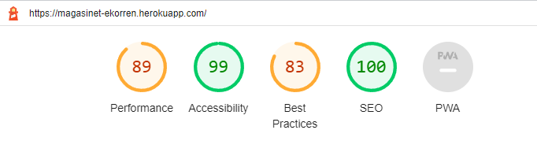

  A test was ran using Lighthouse within Google Chrome to verify performance and accessibility standards were met and to ensure best practices were followed.

  The following steps were done to improve the score on the Lighthouse test:

  - Contrasting text and background colors were altered until complying with AAA-standars, with help from Google Dev Tools for maximum readability.
  - Images were compressed by using [TinyPNG](https://tinypng.com/).
  - The 'loading = "lazy"' attribute was added to all images, to get them to load when they are scrolled down to, instead of them all loading when the page initially loads.
  - Add alt text to all images and aria-labels to all links.

  The full report can be viewed [here](main/static/readme/lighthouse_expanded.pdf).

  #

## **Wave Testing**

  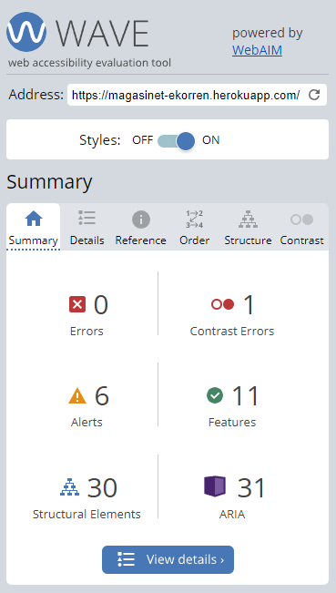

  A further test was ran using the Web Accessibility Evaluation Tool (WAVE) to ensure no errors were returned and to verify that no constrast issues existed on the site. This was an important step to ensure that users with disabilities were not negatively impacted by the design of the site and that the relevant standards have been met.

  - The contrast warning seemed to be a bug in the validator, since i could not find the element where the warning occurred.
  - The Alerts related to the hierarchy of the header elements not appearing in falling order. I decided to ignore these alerts since i was happy with how the headings visually represented their respective elements.

  #

## Bugs

### CSRF verification failed

An error that contiuously popped up during development was this:
```
Forbidden (403) CSRF verification failed. Request aborted.
```

Django requires CSRF-tokens (Cross Site Request Forgery) in their forms as a security measure to safely handle requests. Read more on CSRF [here](https://docs.djangoproject.com/en/4.1/ref/csrf/).
In the django settings.py-file you need to explicitly state trusted origins for unsafe requests (e.g POST).
In local development my URL changed day by day (e.g. https://8000-johneriksson88-ekorren-us6khvjs3ar.ws-eu83.gitpod.io/), and when testing my forms and submitting, I was presented with the error above. I soon learned that i had to change the CSRF_TRUSTED_ORIGINS settings variable as my URL changed. 

### Database server bugs

The database is hosted by [ElephantSQL](https://customer.elephantsql.com/). Towards the projects end i started getting this error:

```
OperationalError at /login/
connection to server at "mouse.db.elephantsql.com" (13.49.141.18), port 5432 failed: FATAL:  too many connections for role "database_name"
```

After some googling i learned that the free plan on ElephanSQL is to have a maximum of 5 open connections at the same time on their free plan. Looking at the [Django documentation](https://docs.djangoproject.com/en/2.1/ref/databases/#persistent-connections) on persistent connections i learned that i could time out the connections after a set amount of time. 
I added the CONN_MAX_AGE setting to the database settings in setting.py like this:
```
DATABASES = {
    'default': {
        'HOST': dj_database_url.parse(os.environ.get('DATABASE_URL')),
        'CONN_MAX_AGE': 0
    }
}

```

Setting CONN_MAX_AGE to 0 terminates the connections immediately, since there is no reason to keep them open after a request. This seems to have fixed the problem.

In the future I am likely to change the database host to a paid service. This is a decision that the site owner will have to take.

### Email SMTP server bugs

When sending an email, either via the contact form on the landing page or making/deleting and order, I sometimes got the following error:
```
Error: SMTP Sender Refused
(530, b'5.7.0 Authentication Required)
```

After googling the error this seemed to be caused on the server side of the [Mailtrap](https://mailtrap.io/) SMTP server i use. I have not found the exact cause of this bug since i can't reproduce it. I found that going into Mailtrap and resetting the credentials for the API made the error go away. I will put a pin in this error since I feel that I have no control over it and that it may come back. Changing to another SMTP service could solve the problem. 

In the future, I will change the email settings from the test server to a paid SMTP server plan that can send emails to other recipients than the test server. This is a decision that is on the site owners table, and I am waiting to implement it as soon as i get a go ahead from them.

## Credits

### Images & Icons

  [FOTOGRID](https://www.shutterstock.com/sv/g/fotogri)

  - The four images on the product cards 

  #

  [r.classen](https://www.shutterstock.com/sv/g/rclassenlayouts)

  - Hero image

  #

  [Fontawesome](https://fontawesome.com/icons)

  - All icons apart from the acorn and the four icons in the "Why us" section
  
  #

  [Pixel Perfect](https://www.flaticon.com/authors/pixel-perfect)

  - Acorn in logo, flaticon and footer
  
  #

  [Freepik](https://www.flaticon.com/authors/freepik)
    
  - Calendar icon
  - Unloading truck icon
  - Open lock icon

  #

  [Good Ware](https://www.flaticon.com/authors/good-ware)
    
  - Security camera icon


### Content

  **Text**
  
  - All text was written by me, John Eriksson, with inspiration and information from the original [Magasinet Ekorren website](https://www.forraduppsala.se/).

  #

  [Google maps](https://www.google.com/maps)

  - Embedded map

  **Log in page and register page**

  - The design was derived from Youtuber [Dennis Ivy](https://www.youtube.com/c/DennisIvy?app=desktop)s tutorial on [Django user registration](https://www.youtube.com/watch?v=tUqUdu0Sjyc&t=694s&ab_channel=DennisIvy).

  **Cookie alert**

  - The cookie alert was derived from GitHub user [Wruczek](https://github.com/Wruczek/)s [Bootstrap Cookie Alert](https://github.com/Wruczek/Bootstrap-Cookie-Alert/).

#

### Honorable mentions

  - [Dennis Ivys](https://www.youtube.com/c/DennisIvy?app=desktop) Youtube series on Django helped immensely with different aspects of Django.
  - [Code Institutes](https://codeinstitute.net/se/full-stack-software-development-diploma/) courses were crucial in introducing me to all involved programming concepts used in this project. Their Tutor Support team also helped me countless times when I felt i had nowhere to go.
  - [Code With Steins](https://www.youtube.com/@CodeWithStein) Youtube channel helped me further my Django abilities, especially with the send_mail functions.
  - [Stack Overflow](https://stackoverflow.com/) is a forum for all things programming and I cant count how many threads I've browsed as soon as an error, bug or other question has come up.
  - [Django forum](https://forum.djangoproject.com/) is another great source for chasing down bugs or errors while exploring Django.
  - [The original Magasinet Ekorren website](https://www.forraduppsala.se/) was the source for most of the content, information about storage units, prices etc. The website is in Swedish.
  - My lovely wife Helena, for giving me pep talks and taking care of our two young boys while I was hammering away on the computer.

## My thoughts

As this was my first time working with Django, the whole project was a learning process. There are some parts that I could improve on, and I'm sure I will in the future as I finish the course. The nature of having a deadline between home and work life put time constraints on the project that i simply couldn't control. I am happy with the result and it works as intended.

Working with Django is for me a double edged sword. I love the "batteries included" part of Django, which keeps me from having to "invent the wheel" over and over again. For example the User model together with the auth library for log in, registration etc. was a breeze to work with.
On the other hand, I feel that there's so much happening under the hood that I have no idea how they work. It's almost like magic. For example, the database felt like some kind of mystical being just existing and working in the background. It wasn't until i had some problems with it I had to dive in under the hood to see what was happening.

To summarize, Django is a very handy tool for quickly creating fully working applications, but many of aspects of it are kind of out of the developers control. That said, I can't imagine doing the same project without a framework like Django.